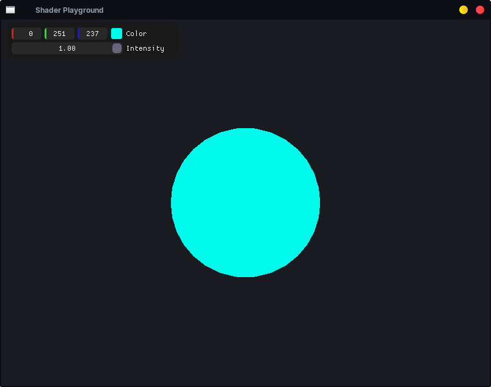

# Shader Playground

## Objetivo

Criar um ambiente para experimentar shaders GLSL.

## Funcionalidades

- Hot Reload
- Uniforms
- ImGui

## Desafios

- [x] Hot Reload
- [x] Uniforms

## O que aprendi

- Como recompilar shaders em tempo real
- Como enviar uniforms
- Como usar ImGui para depuração