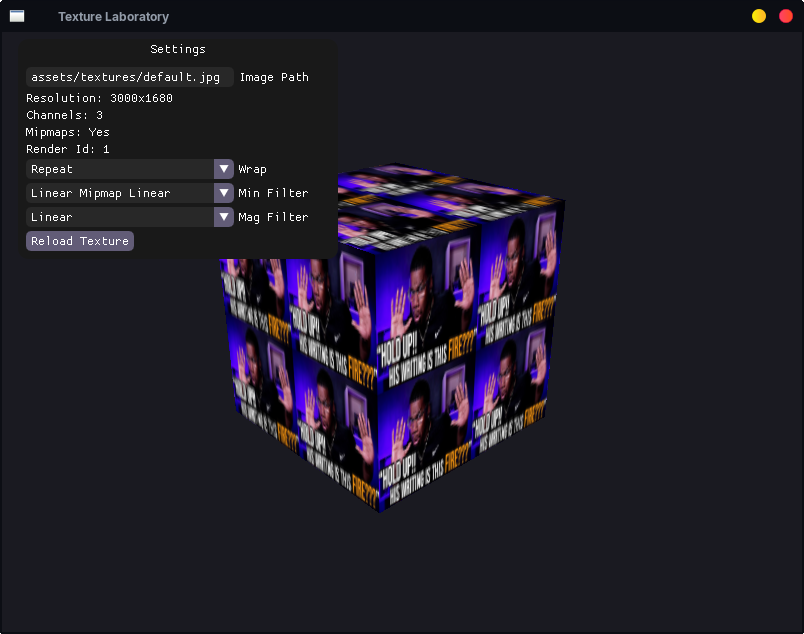

# Texture Laboratory

## Objetivo

Uma aplicação para visualizar e experimentar texturas em tempo real, permitindo explorar diferentes modos de amostragem e carregamento de imagens no OpenGL.

## Funcionalidades

- Carregamento de texturas
- Hot Reload de texturas
- Interface com ImGui
- Alteração de Texture Wrapping
- Alteração de Texture Filtering
- Informações da textura (resolução, canais, mipmaps e ID)

## Desafios

- [x] Implementar uma classe `Texture`
- [x] Alterar Texture Wrapping em tempo real
- [x] Alterar Texture Filtering em tempo real
- [x] Recarregar texturas sem reiniciar a aplicação
- [x] Exibir informações da textura na interface

## O que aprendi

- Como carregar imagens usando `stb_image`
- Como criar texturas com `glTexImage2D`
- Como funcionam coordenadas UV
- Diferença entre Minification e Magnification Filter
- Como funcionam os modos de Wrapping
- Como gerar e utilizar Mipmaps
- Como modificar parâmetros de uma textura em tempo real
- Como utilizar o ImGui para criar ferramentas de depuração